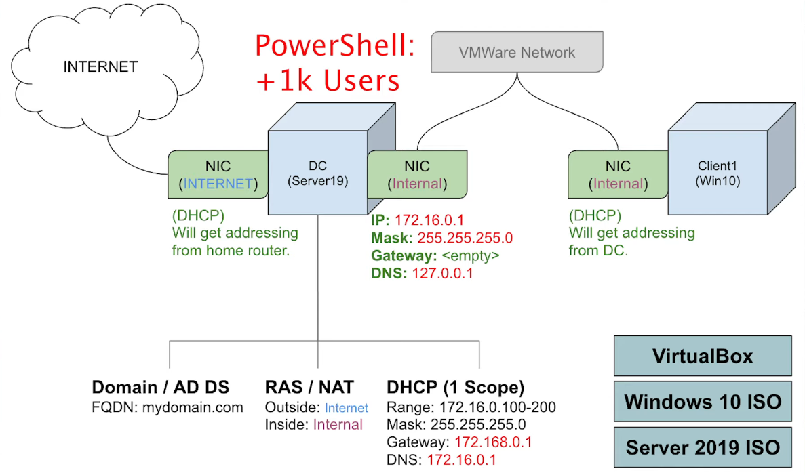

# Home Lab Running Active Directory (Oracle VirtualBox) | Add Users w/PowerShell

<figure><figcaption>
Overview of the Home Lab
</figcaption></figure>

***

## TL;DR

_Technologies used: Oracle VirtualBox, PowerShell, VMWare, Windows_

_Download Links:_

_Oracle VirtualBox:_ [_https://www.virtualbox.org/wiki/Downl..._](https://www.youtube.com/redirect?event=video\_description\&redir\_token=QUFFLUhqbmo4LVBERTZkczVkSWJnQVdlR3JFOXFiMlhqQXxBQ3Jtc0trM3QtNGNQQXpRWWN1WWhudW5vODdlVmVwd29qM210RHlLS3h6YXA2MVQ4TFhqbF9Ja095YzhkaWhsaDBPUmlMSHd5aE94Y0lzUHhrZEhfb29KalM5YmljRzN6MXN3M3U5bFpBSUhiRVdKejJyUS1GTQ\&q=https%3A%2F%2Fwww.virtualbox.org%2Fwiki%2FDownloads\&v=MHsI8hJmggI)&#x20;

_Server 2019 ISO:_ [_https://www.microsoft.com/en-us/evalc..._](https://www.youtube.com/redirect?event=video\_description\&redir\_token=QUFFLUhqa3p3WjViRnJuTTQ2WUw0QXhmMGxTdzhlejM5QXxBQ3Jtc0tuVk1fQWw2ZDlLOXNBYjFlYTY3eW1ibEJFajJucnlrb2NHUDlSUFZBZzl1Z1ZmcnpfRE54SzQyTWtRS2NiNGdQMVNnbzVyX1dwNXpDRjcyTXNPSDMwc3VIZFh1Yy0tMUtFbGIzNVBoSHB0MGJSRDk3UQ\&q=https%3A%2F%2Fwww.microsoft.com%2Fen-us%2Fevalcenter%2Fdownload-windows-server-2019\&v=MHsI8hJmggI)&#x20;

_Windows 10 ISO:_ [_https://www.microsoft.com/en-us/softw..._](https://www.youtube.com/redirect?event=video\_description\&redir\_token=QUFFLUhqa3p6V3IyRF9fbHh3WXZ1NVUtU1hOVXgwcnlid3xBQ3Jtc0trV1JEQzhOajhIa2U4LS1fcEYtZ3NPSGFTYldjeFhXaHJ1elZfYWNVY1BUMXJMQldvbjgxNkdBS2p6aEI0Ujg4RjNqek0xRUd3aWMzSVZCb1g0a040Q2dabjdRWU5YdGZnRnVlNldvUy1reGxpMFktTQ\&q=https%3A%2F%2Fwww.microsoft.com%2Fen-us%2Fsoftware-download%2Fwindows10ISO\&v=MHsI8hJmggI)

I set up a home lab to run Active Directory using Oracle VirtualBox. First, I created a Windows Server virtual machine (VM) to serve as my domain controller. After setting up the VM, I installed and configured Active Directory Domain Services (AD DS) and set up the domain. Once the domain was ready, I used PowerShell scripts to add users to my Active Directory efficiently, showcasing how automation can simplify user management tasks.

***

## Introduction

In this guide, I'll walk you through how I set up a home lab to run Active Directory using Oracle VirtualBox. I'll cover creating a Windows Server virtual machine (VM) to act as a domain controller, installing and configuring Active Directory Domain Services (AD DS), and using PowerShell to add users to Active Directory. This setup will help you understand how to manage an Active Directory environment and automate user management tasks.

***

## Stage 1: Setting Up Oracle VirtualBox and Creating a VM

* **Download and Install Oracle VirtualBox:** I started by downloading and installing Oracle VirtualBox on my computer from the official website.

<figure><figcaption></figcaption></figure>

* **Create a New Virtual Machine:** Next, I launched VirtualBox and created a new VM. I chose "Windows Server" as the operating system and allocated appropriate resources (CPU, RAM, and disk space) for the server.]

***

## **Stage 2: Installing Windows Server on the VM**

* **Download Windows Server ISO:** I downloaded the Windows Server ISO file from the official Microsoft website.
* **Install Windows Server:** I started the VM and mounted the Windows Server ISO file. I followed the installation wizard to install the operating system on the VM.
* **Configure Windows Server:** After installation, I configured the server settings, such as setting a strong password for the administrator account and adjusting network settings to ensure the VM could connect to the internet.
* **Add Guest Additions:** I added guest additions for better scrolling and use of the VM &#x20;

<figure><figcaption></figcaption></figure>

***

## Installing and Configuring Active Directory Domain Services (AD DS)

* **Install AD DS Role:** On the Windows Server VM, I opened the Server Manager and added the Active Directory Domain Services role.

<figure><figcaption></figcaption></figure>

* **Promote Server to Domain Controller:** I used the AD DS Configuration Wizard to promote the server to a domain controller. I specified a new forest and domain name and followed the prompts to complete the configuration.

<figure><figcaption></figcaption></figure>

* **Verify Installation:** After the server rebooted, I verified that the domain controller was functioning correctly by checking the AD DS and DNS server roles.

***

## Finalization: Adding Users to Active Directory with PowerShell

* **Open PowerShell:** I opened PowerShell as an administrator on the domain controller.
* **Create User Accounts:** I executed PowerShell scripts to create user accounts in Active Directory. The scripts included commands to define user properties.

<figure><figcaption></figcaption></figure>

***

## Results

By following these steps, I successfully set up a home lab environment running Active Directory on a Windows Server VM in Oracle VirtualBox. I was able to install and configure AD DS, promote the server to a domain controller, and use PowerShell scripts to manage user accounts efficiently.

***

## Takeaways

Setting up a home lab for Active Directory using Oracle VirtualBox gave me valuable hands-on experience in managing an AD environment. I learned how to install and configure a Windows Server, set up Active Directory Domain Services, and automate user management with PowerShell. This knowledge will be useful for understanding enterprise-level network management and improving my Cybersecurity/IT administration skills.
